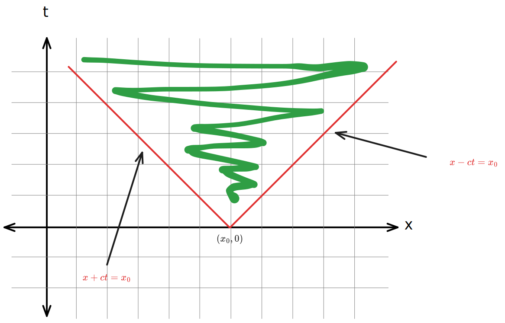

# The Wave Equation

## _Def._ Wave Equation

The (one-dimensional) **wave equation** (on the line) is defined as

$$
u_{tt} = c^2 u_{xx}
$$

where $x \in (-\infty, \infty)$ and $t > 0$. The general solution is easy to solve since operators factor out nicely:

$$
u_{tt} - c^2 u_{xx} = \left(\dfrac{\partial}{\partial t} - c\dfrac{\partial}{\partial x}\right)\left(\dfrac{\partial}{\partial t} + c\dfrac{\partial}{\partial x}\right)u = 0
$$

so that

$$
\boxed{u(x,t) = f(x+ct) + g(x-ct)}
$$

where $f$ and $g$ are twice-differentiable arbitrary functions of single variable.

## _Thm._ Initial Value Problem

Assume we are given an initial value problem for the wave equation so that

$$
\def\arraystretch{1.5}
\begin{array}{rcl}
u_{tt} - c^2 u_{xx} &=& 0  \\
\hdashline
u(x, 0) &=& g(x) \\
u_t(x, 0) &=& h(x)
\end{array}
$$

where $\phi$ and $\psi$ are arbitrary. There is one and only one solution of this problem which is

$$
\boxed{
    u(x,t) = \dfrac{g(x+ct) + g(x-ct)}{2} + \dfrac{1}{2c} \displaystyle \int_{x-ct}^{x+ct} h(s) \> ds
}
$$

## _Def._ Inhomogeneous Wave Equation

Let $f \in C^2(\R^2, \R)$, then the **inhomogeneous wave equation** is defined as

$$
u_{tt} - c^2 u_{xx} = f(x,t)
$$

## _Thm._ d'Alembert's Formula

Let

$$
u_{tt} - c^2 u_{xx} = f(x,t)
$$

be an inhomogenous wave equation with the initial conditions

$$
\def\arraystretch{1.25}
\begin{array}{ccc}
u(x,0) &=& g(x) \\
u_t(x,0) &=& h(x) \\
\end{array}
$$

then the solution is given by the formula

$$
\def\arraystretch{2.5}
\begin{array}{rll}
u(x,t) = & \dfrac{g(x+ct) + g(x-ct)}{2} \\ + & \dfrac{1}{2c} \displaystyle \int_{x-ct}^{x+ct} h(s) \> ds \\ + & \dfrac{1}{2c} \displaystyle \int_0^t \int_{x-c(t - \tau)}^{x+c(t - \tau)} f(s,\tau) \> ds \> d\tau
\end{array}
$$

notice that the double integral is over the **characteristic triangle $\Delta$**.

Moreover, if this problem on the half line i.e. with extra boundary condition

$$
u(0,t) = r(t)
$$

then the solution is the same as above for $x > ct > 0$, but for $0 < x < ct$, we have

$$
u(x,t) = \cdots \textcolor{red}{ + r\left(t - \dfrac{x}{c}\right) + \dfrac{1}{2c} \iint_D f}
$$

where $t - x/c$ is the reflection point and $D$ is the corresponding shaded region.

## _Thm._ Causality

Effect of initial position $\phi(x)$ is a pair of waves traveling in either direction at speed $c$ and at half the original amplitude. The effect of an initial velocity $h(x)$ is a wave spreading out at speed $\leq c$ in both directions, so part of the wave may lag behind (if there is an initial velocity) but no part goes faster than speed $c$. This is called the **principal of causality**.

<!-- 

  

 -->

> See and add principle of causality figure p. 39

An initial condition (position or velocity or both) at the point $(x_0, 0)$ can affect the solution for $t > 0$ only in the shaded sector, which is called the **domain of influence** of the point $(x_0, 0)$.

The **domain of influence** corresponds to the shaded are for the (upwards) triangle $x+ct = x_0$, $x - ct = x_0$ and $(x_0,0)$.

The **domain of dependence** or the **past history** of the point $(x,t)$ corresponds to the shaded area for the (downwards) triangle $(x-ct, 0)$, $(x+ct,0)$ and $(x,t)$.

## _Thm._ Energy

Imagine an infinite string with constant $\rho$ and $T$, so that

$$
\rho u_{tt} = T u_{xx}
$$

then

$$
\boxed{
    PE = \dfrac{1}{2} T \int_{-\infty}^\infty u_x^2 \> dx
}
$$

and noting the total energy is given by $E = KE + PE$, we have

$$
\boxed{
    E = \dfrac{1}{2} \int_{-\infty}^\infty (\rho u_t^2 + Tu_x^2) \> dx
}
$$

<!-- TODO: half-line -->

## _Thm._ Reflection of Waves

Assume we are given an Dirichlet problem on the half-line $(0, \infty)$ for the wave equation so that

$$
\def\arraystretch{1.5}
\begin{array}{rcl}
v_{tt} - c^2 v_{xx} &=& 0  \\
\hdashline
v(x, 0) &=& g(x) \\
v_t(x, 0) &=& h(x) \\
\hdashline
v(0, t) &=& 0
\end{array}
$$

where $x \in (0, \infty)$ and $t \in (-\infty, \infty)$. Then, the solution for $\textcolor{red}{x > c |t|}$ is given by

$$
v(x,t) = \dfrac{1}{2}(g(x+ct) \textcolor{red}{+} g(x-ct)) + \dfrac{1}{2c} \int_{\textcolor{red}{x-ct}}^{\textcolor{red}{x+ct}} h(y) dy
$$

and for $\textcolor{red}{0 < x < c|t|}$ we have

$$
v(x,t) = \dfrac{1}{2}(g(x+ct) \textcolor{red}{-} g(x-ct)) + \dfrac{1}{2c} \int_{\textcolor{red}{ct-x}}^{\textcolor{red}{ct+x}} h(y) dy
$$

> See Figure 2 in p. 62

## _Thm._ Duhamel's Principle
