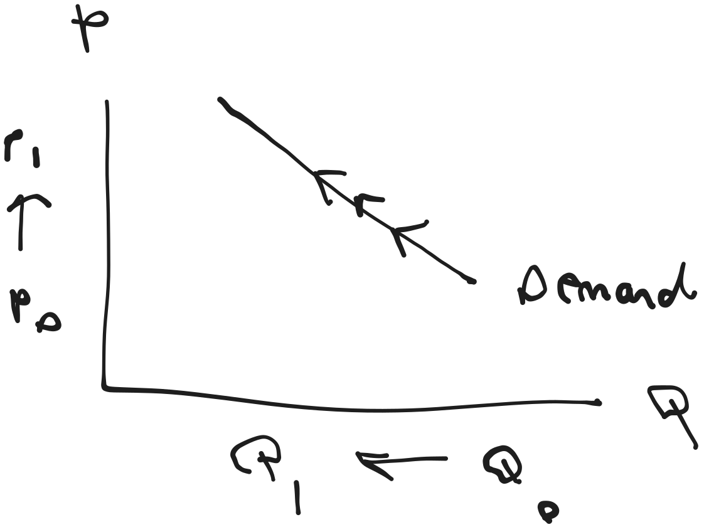

# Supply and Demand

[**Go Back to Index**](./00-index.md)

## Demand

Demand refers to **willingness** and **ability** of someone to purchase a good and service.

The **law of demand** states that the quantity of a good demanded is inversely related to the good's price.

 

    

 

I'm just bored. I am going to stop taking notes about this.
